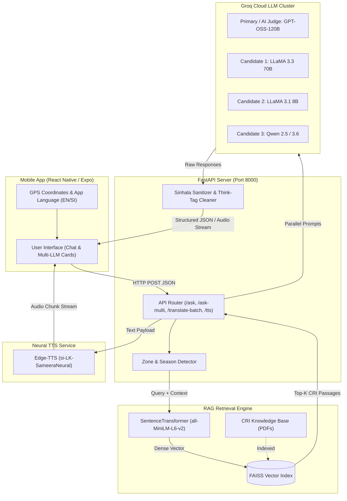
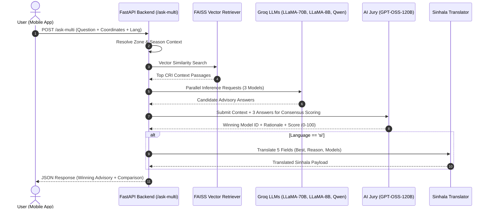

# Coconut Advisory System - FastAPI Backend

A high-performance FastAPI backend service powering **SaruPol**, an AI-driven Retrieval-Augmented Generation (RAG) advisory platform engineered for Sri Lankan coconut farmers.

It integrates vector search across Coconut Research Institute (CRI) guidelines, Multi-LLM consensus validation, a farmer-friendly agricultural Sinhala translation pipeline, and real-time Neural Text-to-Speech (TTS) streaming.

---

## 🏗️ System Architecture



---

## 🤖 Multi-LLM Consensus & Jury Evaluation Architecture



---

## 📊 Technical Specifications of LLMs & AI Models

| Component | Model / Engine | Provider / Library | Key Technical Specs & Purpose |
| :--- | :--- | :--- | :--- |
| **Primary LLM & AI Jury** | `openai/gpt-oss-120b` | Groq API Cloud | **120B Parameters**. Used as primary advisory generator, AI Jury evaluator, and high-capacity Sinhala translation model. Exceptional Sinhala grammar fidelity and low latency. |
| **Candidate Model 1** | `llama-3.3-70b-versatile` | Meta / Groq API | **70B Parameters**. High analytical capacity for detailed agronomic recommendations. |
| **Candidate Model 2** | `llama-3.1-8b-instant` | Meta / Groq API | **8B Parameters**. Fast inference engine with 500,000 Tokens-Per-Day (TPD) quota limit. |
| **Candidate Model 3** | `qwen/qwen3.6-27b` | Alibaba / Groq API | **27B Parameters**. Multilingual reasoning model utilized for parallel candidate comparison. |
| **Text Embeddings** | `all-MiniLM-L6-v2` | SentenceTransformers | **384-dimensional dense vectors**. Computes cosine similarity across indexed CRI PDF documents. |
| **Vector Index** | FAISS Index | Meta FAISS (`IndexFlatIP`) | Fast in-memory similarity search over agricultural document chunks. |
| **Neural TTS** | `si-LK-SameeraNeural` | Microsoft `edge-tts` | Neural Sinhala voice customized with a `-10%` speech rate for clear farmer listening comprehension. |

---

## 🌍 Server-Side Agro-Climatic Zone & Season Resolution

The backend automatically detects the Sri Lankan agricultural context based on incoming GPS coordinates and system date:

### Agro-Climatic Boundary Coordinates
- **Wet Zone**: `Lat 5.9°N – 7.5°N, Lon 79.8°E – 80.6°E`
- **Intermediate Zone**: `Lat 5.9°N – 8.0°N, Lon 79.8°E – 81.2°E`
- **Dry Zone**: `Lat 5.5°N – 10.0°N, Lon 79.5°E – 82.0°E`

### Seasonal Logic
- **Yala Season**: May to September (South-West Monsoon)
- **Maha Season**: October to April (North-East Monsoon)

---

## 🚀 Installation & Quick Start

### 1. Prerequisites
- Python 3.9+
- Groq API Key ([console.groq.com](https://console.groq.com/))
- Pre-built vector index in `faiss_index/`

### 2. Setup Virtual Environment
```bash
cd backend
python -m venv venv

# Activate Environment
# Windows:
venv\Scripts\activate
# macOS/Linux:
source venv/bin/activate

# Install Dependencies
pip install -r requirements.txt
```

### 3. Environment Configuration (`.env`)
Create `.env` in `backend/`:
```env
API_HOST=0.0.0.0
API_PORT=8000
DEBUG=False

GROQ_API_KEY=your_groq_api_key_here

KNOWLEDGE_BASE_DIR=../knowledge_base
FAISS_INDEX_DIR=../faiss_index

ALLOWED_ORIGINS=*
```

### 4. Running the Server
```bash
# Development server
python -m app.main

# Production Uvicorn server
uvicorn app.main:app --host 0.0.0.0 --port 8000 --workers 4
```

Swagger API Documentation: `http://localhost:8000/docs`

---

## 📖 API Endpoint Documentation

### 1. Standard RAG Advisory Query (`POST /ask`)
Queries the RAG vector engine and returns an advisory response.
```json
// POST /ask
{
  "question": "How should I fertilize young coconut palms?",
  "context": "Wet Zone | Yala Season (August)",
  "language": "si"
}
```

### 2. Multi-LLM Consensus Validator (`POST /ask-multi`)
Queries 3 LLMs in parallel and uses an AI Jury model to evaluate and rank answers.
```json
// POST /ask-multi
{
  "question": "How do I control termites in coconut nursery?",
  "latitude": 6.9271,
  "longitude": 79.8612,
  "language": "si"
}
```

### 3. Batch Message Translation (`POST /translate-batch`)
Batch translates chat messages into Sinhala (`si`) or English (`en`).

### 4. Neural Text-To-Speech (`GET /tts`)
Generates real-time MP3 speech audio streams for Sinhala (`si-LK-SameeraNeural`) and English (`en-US-AriaNeural`).

---

## 🛡️ License

Developed for the Coconut Advisory System (SaruPol).
